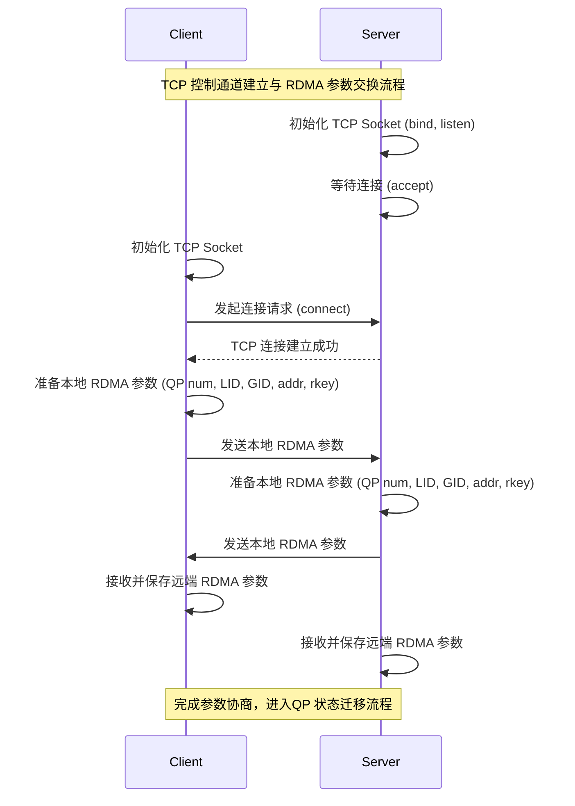

```mermaid
sequenceDiagram
    participant Client
    participant Server

    Note over Client,Server: TCP 控制通道建立与 RDMA 参数交换流程

    Server->>Server: 初始化 TCP Socket (bind, listen)
    Server->>Server: 等待连接 (accept)
    Client->>Client: 初始化 TCP Socket
    Client->>Server: 发起连接请求 (connect)
    Server-->>Client: TCP 连接建立成功
    Client->>Client: 准备本地 RDMA 参数 (QP num, LID, GID, addr, rkey)
    Client->>Server: 发送本地 RDMA 参数
    Server->>Server: 准备本地 RDMA 参数 (QP num, LID, GID, addr, rkey)
    Server->>Client: 发送本地 RDMA 参数
    Client->>Client: 接收并保存远端 RDMA 参数
    Server->>Server: 接收并保存远端 RDMA 参数
    Note over Client,Server: 完成参数协商，进入QP 状态迁移流程
``` 